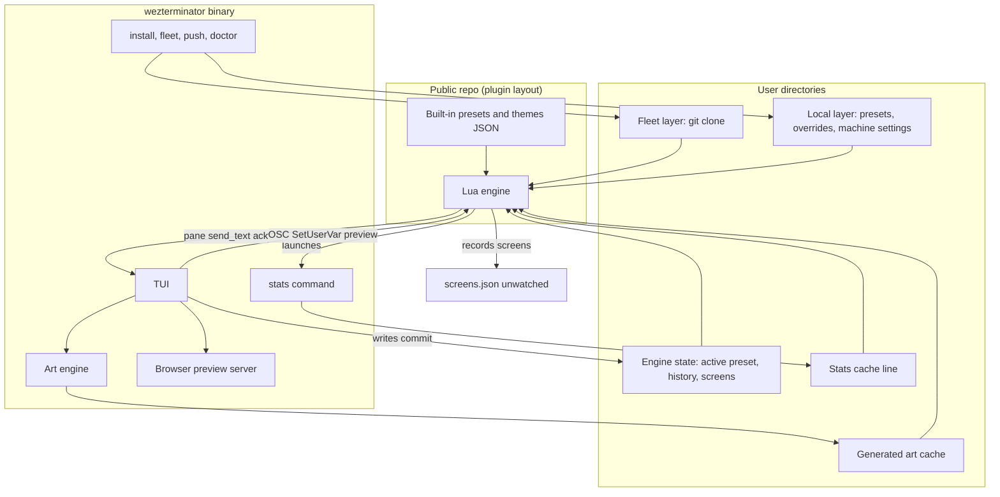
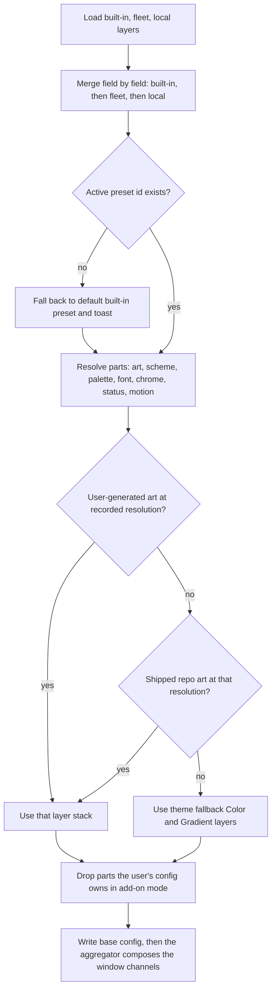
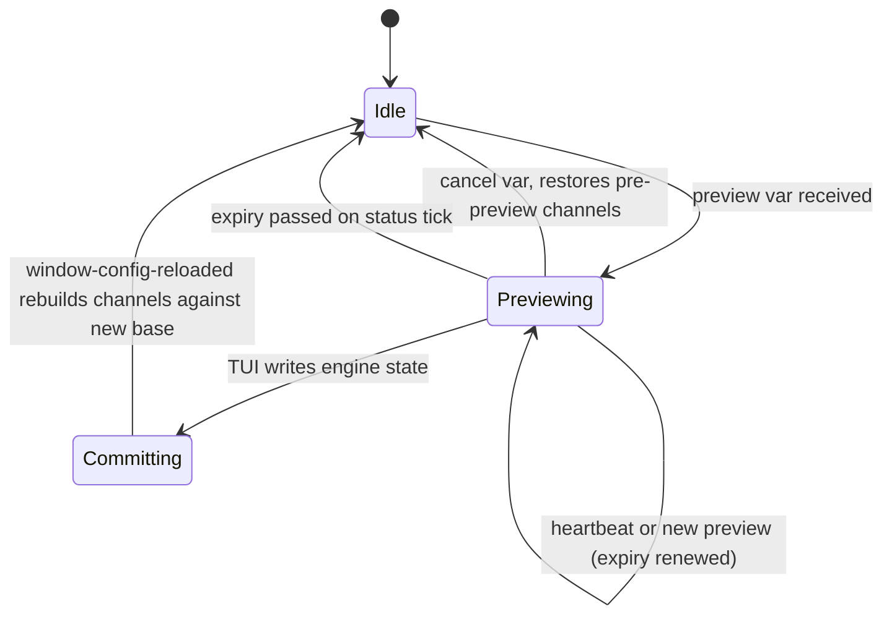

# feat: wezterminator — composable WezTerm presets, Lua engine and Rust toolkit

## Summary

Build wezterminator in four phases:

1. A data-driven Lua engine in WezTerm's plugin layout, with the three origin looks as presets. Daily switching works before any Rust exists.
2. A Rust art engine and the nine new themes.
3. The Rust TUI with window-local, expiring live preview and a browser preview.
4. Installer, fleet layer and SSH push.

JSON is the single data format shared by Lua and Rust. Shared fixture tests keep the two sides' layer-resolution logic in agreement.

---

## Problem Frame

See origin: `docs/brainstorms/2026-10-01-wezterminator-requirements.md`. Two hand-maintained configs need to become one public, composable system. Research added constraints that shape how.

WezTerm 20240203 is the latest stable release, and its Lua can only parse JSON. Every `set_config_overrides` call re-evaluates the whole config. External processes have no CLI to reload the config or set a user var. The existing metis modules each write window overrides independently, so `parallax.lua` would wipe an applied preset on the next ALT+wheel tick.

---

## Requirements

Requirement IDs are carried from the origin. The plan advances all of them.

- **Presets and switching:** R1–R7.
- **Theme parts:** R8–R14.
- **Backgrounds and motion:** R15–R19.
- **Fonts:** R20–R21.
- **TUI:** R22–R27.
- **Theme authoring and art:** R28–R31.
- **Install and machines:** R32–R38.

Acceptance examples AE1–AE8 from the origin are enforced in the test scenarios of the units named below.

---

## Key Technical Decisions

- **JSON everywhere, versioned.** Presets, themes, the fleet layer, local overrides and engine state are JSON files with a `schema_version`. Lua reads them with `io.open` plus `wezterm.json_parse` (falling back to `wezterm.serde.json_decode` when present). Rust uses `serde_json`. TOML was rejected because WezTerm 20240203 has no TOML decoder.
- **Comments are `_` fields.** JSON has no comments, so any object key starting with `_` is a comment at every nesting level: `"_"` describes the enclosing object, and `"_<key>"` describes the sibling `<key>`. Lua strips them on load, before resolution, so they never reach the WezTerm config. Rust keeps them through read and write, so TUI edits don't erase hand-written notes. Schemas allow them through `patternProperties` while still rejecting other unknown keys.
- **The engine is a WezTerm plugin.** The repo has the plugin layout (`plugin/init.lua` exporting `apply_to_config(config, opts)`). Add-on users load it with `wezterm.plugin.require(<git url>)`. Replace mode loads the same entry point from the local checkout. One code path serves both installs.
- **Commit through a file; preview through overrides.** A committed choice is written to the engine state file, which is on WezTerm's reload watch list. WezTerm keeps each window's overrides across a full reload, so the aggregator must rebuild them: on `window-config-reloaded` after a generation change, drop the preview channel, recompute parallax and auto-scroll against the newly resolved base, and write once per window. Font changes come through the base config for free. A preview is a window-local override that is never persisted.
- **One override aggregator.** Only one Lua module calls `set_config_overrides`. Preview, parallax offsets, background pause and auto-scroll each contribute a named channel. Every `set_config_overrides` call re-evaluates the whole config in a fresh Lua state, so channels, last-applied hashes, preview expiry and sequence numbers live in `wezterm.GLOBAL`, keyed by window id (closed windows are cleared). The aggregator composes the channels, compares the result with the last applied value, and writes only when it changed. This prevents the theme-wipe bug and the reload loop.
- **Expiring preview (TUI only).** Previews arriving over OSC from the TUI carry an expiry. The TUI renews it with a heartbeat every second. On each `update-status` tick, Lua clears expired TUI preview channels, so a crashed TUI's window reverts within the expiry window. Previews started by in-WezTerm Lua pickers (`InputSelector`) carry no expiry and are cleared when the selector closes. The preview channel and its expiry rules are owned by `overrides.lua` (U2); `preview.lua` (U12) only speaks the OSC protocol.
- **Layer precedence and identity.** Settings resolve as built-in, then fleet, then local, with later layers winning field by field. Presets keep namespaced ids (`builtin:abyssal`, `fleet:…`, `local:…`), so names can shadow each other but ids never collide. A saved preset is a full snapshot with `based_on` metadata, not a diff, so upstream edits never change it silently.
- **Machine settings are a separate document.** Project roots, issue URL pattern, VPN probes, editor and push targets live in a machine settings file per layer. The preset schema has no field for them. Exporting a preset to the public repo therefore can't leak personal data.
- **Shared resolution fixtures.** Layer merging and preset resolution exist twice, once in Lua and once in Rust. Both test suites run the same fixture inputs and expected outputs, so drift fails CI.
- **Art lookup order.** For the recorded resolution, the engine looks for art in three places, in order:
  1. User-generated art under `$XDG_DATA_HOME/wezterminator/art/<theme>/<W>x<H>/` (on macOS too), with a blake3 recipe hash in a manifest next to the art. Lookup skips user art whose hash does not match the current theme recipe.
  2. Pre-generated art shipped with the repo under `themes/<theme>/art/<W>x<H>/`.
  3. The theme's fallback background, made of WezTerm `Color` and `Gradient` layers.

  Shipped packs are optional, so the engine and tool support them from day one even though the packs come later. Generation targets the device resolution of the largest connected screen. Recorded screens live in a separate `screens.json` in the state directory that is **not** on the reload watch list. Lua writes it only from a GUI event (`gui-startup` or the first `update-status` per process), and only when the content differs. Config evaluation itself writes no files. The Rust tool reads screens from there.
- **When the binary is absent.** Status shows only the Lua-native segments: clock, cwd, battery (from WezTerm's own battery info), workspace and last exit code. Backgrounds still use shipped art when the repo has it for the resolution.
- **Add-on precedence.** In add-on mode, `apply_to_config` records every key the user's config set before the call and never assigns or overrides those keys, including through the aggregator. The TUI reports them as overruled.
- **Rust toolchain.** Use a Cargo workspace, edition 2024, with `rust-version = "1.93"` and resolver 3, so Cargo picks compatible dependency versions. The stack:
  - ratatui 0.30 and crossterm for the TUI
  - image, png and gif for art, writing indexed PNGs with streamed nearest-neighbour upscaling
  - rayon with per-pixel hashed seeds for parallelism
  - palette in Oklab for palette mapping
  - fontique and skrifa for fonts
  - tiny_http for the preview server
  - clap for the CLI
  - etcetera for XDG paths on macOS and Linux
  - blake3 and insta for golden tests
- **Avoid these crates:** imagequant (GPL), git2 and ssh2 (they ignore the user's git and ssh config), sysinfo 0.39 (needs a newer Rust than 1.93), and starship-battery (battery is Lua-native).
- **Shell out where the user's own setup should apply.** Use `git` for the fleet layer, `ssh` and `rsync` for push, `tailscale` and `warp-cli` for VPN state, and `wezterm ls-fonts` to confirm what WezTerm actually resolves. These run without a shell and with hard timeouts.
- **Stats collector.** `wezterminator stats` is a one-shot command that writes one key=value cache line atomically. Lua launches it fire-and-forget at most once per second, keeping the existing metis pattern. There is no resident daemon (origin: outside the product's identity).
- **Platform support.** The minimum is WezTerm 20240203. On Linux, chrome blur shows as unavailable unless the engine detects `wayland_window_background_blur` (nightly). Windows is best-effort: no zsh or fzf dependencies remain, because pickers move to WezTerm `InputSelector` and the TUI.

---

## High-Level Technical Design

### Components



### Preset resolution



### Preview lifecycle (per window)



Expiry is checked on WezTerm's status tick. The preview channel lives only in that window's overrides (backed by `wezterm.GLOBAL`), so other windows and the persisted state are untouched until commit. After commit, `window-config-reloaded` drops the preview channel and rebuilds offset channels over the newly resolved layer stack.

---

## Output Structure

```text
wezterminator/
  plugin/
    init.lua                    -- apply_to_config entry
    wzt/                        -- engine modules: data, layers, overrides, status, parallax, ...
  presets/                      -- built-in preset JSON
  themes/<theme>/theme.json     -- palette, layer recipe, fallback layers, motion defaults
  schema/                       -- JSON Schema for preset, theme, machine settings, state
  tests/
    fixtures/resolution/        -- shared Lua/Rust resolution cases
    lua/                        -- Lua harness with a wezterm stub
  crates/
    wzt-model/                  -- schema types, layer resolution, paths
    wzt-art/                    -- primitives, palettes, dithering, generators, import, legibility
    wzt-stats/                  -- one-shot collector
    wzt-fonts/                  -- discovery and glyph coverage
    wzt-preview/                -- OSC protocol and browser preview server
    wzt-tui/                    -- ratatui application
    wzt-ops/                    -- install, undo, migrate, doctor, fleet, push
    wezterminator/              -- clap binary
  docs/
```

The per-unit **Files** lists are authoritative. This tree shows the intended shape.

---

## Implementation Units

### Phase 1 — Engine and origin presets (no Rust)

### U1. Data schema and shared fixtures

**Goal:** Define the JSON documents and the resolution rules that both runtimes implement.

**Requirements:** R1, R4, R5, R8, R27, R31

**Dependencies:** none

**Files:**
- `schema/preset.schema.json`
- `schema/theme.schema.json`
- `schema/machine.schema.json`
- `schema/state.schema.json`
- `tests/fixtures/resolution/*.json`
- `docs/data-model.md`

**Approach:**
- A preset names one choice per part and carries `id`, `name` and `based_on`. Its font part declares preferred fonts and the fallback font list (R7). A theme holds its palette (semantic UI keys plus a terminal scheme), layer recipe, fallback layers, motion defaults and legibility sample colours.
- Machine settings hold project roots, issue URL pattern, VPN probes, editor, push targets, a development-only art path and screen-resolution overrides. Personal values exist only in machine settings files.
- The state document holds the active preset id, a capped undo history of 20 entries, the install mode, and the engine's resolved plugin directory plus engine version (so Rust reads the same built-ins the running Lua uses). Recorded screens live in a sibling `screens.json`, not in the watched state document.
- Every object schema has `"patternProperties": { "^_": {} }` alongside `"additionalProperties": false`.
- Fixtures cover merge order, shadowing, a missing active preset, an unknown future `schema_version`, add-on-owned keys, an empty array versus an empty object, and `_` comment keys at several depths.

**Test scenarios:**
- Each fixture has an input layer set and an expected resolved preset. The fixtures are consumed by the tests in U2 and U5.
- Edge: a local preset whose `based_on` parent was deleted upstream still resolves, because it is a snapshot.
- Edge: a fleet `schema_version` higher than the engine supports is ignored with a reported reason.
- Edge: a theme with `"_"` and `"_palette"` comments, and a `"_"` inside a layer entry, validates and resolves exactly as it would without them. A misspelled non-underscore key still fails validation.

**Verification:** every schema validates every built-in file, and the fixture set covers each resolution rule listed under Key Technical Decisions.

### U2. Lua engine core

**Goal:** Load the layers, resolve the active preset, apply it to the config, and own every window override.

**Requirements:** R2, R3, R6, R7, R8, R9, R18, R25, R33; AE1

**Dependencies:** U1

**Files:**
- `plugin/init.lua`
- `plugin/wzt/data.lua`
- `plugin/wzt/resolve.lua`
- `plugin/wzt/apply.lua`
- `plugin/wzt/overrides.lua`
- `plugin/wzt/state.lua`
- `plugin/wzt/platform.lua`
- `tests/lua/run.lua`
- `tests/lua/wezterm_stub.lua`
- `tests/lua/resolve_test.lua`
- `tests/lua/overrides_test.lua`

**Approach:**
- `apply_to_config(config, opts)` finds its own directory through `wezterm.plugin.list()`, or through `opts.dir` when loaded from a checkout, and extends `package.path`. It writes the resolved plugin directory and engine version into the state directory for the Rust side.
- In add-on mode it snapshots the keys already set on `config`.
- It reads the layers and puts the local and state files (not `screens.json`) on `wezterm.add_to_config_reload_watch_list`.
- `data.lua` removes `_`-prefixed keys recursively right after decoding, so no later module needs to know about them. Parsed layer JSON is cached in `wezterm.GLOBAL` under a generation counter that increments on each full reload (watched-file change). Override-triggered re-evaluations reuse that cache; WezTerm 20240203 has no file-stat API, so modification-time keys are not used.
- `resolve.lua` is pure Lua with no `wezterm` calls, so it runs under stock Lua against the U1 fixtures. A second fixture run inside WezTerm 20240203 uses `wezterm.json_parse`, and both outputs are normalised (sorted keys, explicit empty-array markers) before comparison with Rust.
- `overrides.lua` keeps per-window named channels in `wezterm.GLOBAL`. It composes them, deep-compares the result with the last applied table, and calls `set_config_overrides` only on change. On `window-config-reloaded` after a generation change, it drops the preview channel, rebuilds background-carrying channels from the newly resolved preset, and writes at most once per window.
- Commit, undo and cycle write the state file atomically (temp file then `os.rename`) and let the reload propagate. Only the TUI and CLI write the active preset and history in `state.json`; Lua never writes that file during evaluation.
- `platform.lua` detects OS and WezTerm version and probes for optional config keys, including the blur keys and `wezterm.serde`.
- Chrome options that are unavailable are reported, not set.
- Recording screens is guarded, because `wezterm.gui` is nil inside the mux server. When screens are recorded, they go to unwatched `screens.json` and only when the list changed.

**Patterns to follow:**
- `sources/metis/config/themes.lua`: read-line and write-line persistence, and the `user-var-changed` handling.
- `sources/metis/wezterm.lua.shim`: the reason the watched path matters.
- `sources/metis/config/backgrounds.lua`: `config_for` as the single source for startup and live paths.

**Test scenarios:**
- Happy path: every U1 fixture resolves to its expected output under stock Lua and again inside WezTerm with `wezterm.json_parse`.
- Overrides: the parallax and preview channels combine without either wiping the other. Clearing preview leaves parallax intact.
- Overrides: applying an identical composition twice results in a single `set_config_overrides` call.
- Overrides: after a commit with an active preview and a non-zero parallax offset, `window-config-reloaded` shows the new theme's layers with the offset kept.
- Overrides: a harness stub that discards module locals between evaluations still keeps channels via `wezterm.GLOBAL`.
- Covers AE1. Committing Abyssal writes the state file. A simulated reload resolves Abyssal, and the state survives a fresh evaluation.
- Edge: the active preset is missing, so the default built-in resolves and a toast is recorded.
- Edge: in add-on mode with the user's `font` set, the resolved font part is dropped and listed as overruled.
- Edge: on a platform without a blur key, the blur chrome option is reported unavailable and not set.
- Edge: a `_` comment key placed on a chrome object never appears in the applied config or in the window overrides.
- Edge: config evaluation with an unchanged screen list writes no file.
- Undo: three commits followed by two undos lands on the first preset. The history stops at 20 entries.

**Verification:** with a WezTerm 20240203 checkout loaded through a local `file://` plugin URL, switching between two hand-written presets re-themes all windows. The reload log shows one base evaluation per commit plus at most one override write per window.

### U3. Port metis features onto the engine

**Goal:** Bring status, parallax, projects, quick-select, the inspect menus and the command palette across as engine modules driven by machine settings.

**Requirements:** R10, R11, R12, R13, R14, R16, R18, R26 (key conflicts groundwork), R27, R38

**Dependencies:** U2

**Files:**
- `plugin/wzt/status.lua`
- `plugin/wzt/segments/*.lua`
- `plugin/wzt/parallax.lua`
- `plugin/wzt/projects.lua`
- `plugin/wzt/quickselect.lua`
- `plugin/wzt/inspect.lua`
- `plugin/wzt/keys.lua`
- `plugin/wzt/palette.lua`
- `tests/lua/status_test.lua`
- `tests/lua/keys_test.lua`

**Approach:**
- Status has two styles: sparkline (from metis) and pill (from OD-Cezar). Segments and their order come from the resolved preset, and colours from semantic palette keys.
- Segments read the stats cache and Lua-native sources only. Segments that need the binary hide when the cache is absent. Battery is Lua-native only (WezTerm battery info), never from the stats cache.
- Parallax contributes the vertical and horizontal offset channels. Auto-scroll (speed in pixels per tick, wrapping at strip width, at most one aggregator write per tick) is implemented here in `parallax.lua` and is off by default (R16). Background pause contributes a channel that replaces the layer stack with the base colour; toggling it again restores the stack and leaves parallax offsets intact (R18).
- Projects, quick-select and the editor read machine settings. No personal defaults.
- Keys are declared as data with ids. In add-on mode, conflicts with the user's `config.keys` and `leader` are detected and reported.
- The scheme and font pickers become `InputSelector` menus with live preview through the preview channel (no expiry; cleared when the selector closes). No zsh or fzf.

**Patterns to follow:**
- `sources/metis/config/status.lua`: fixed-width sparklines and once-per-second sampling.
- `sources/metis/config/parallax.lua`: why ALT+wheel, and slack clamping.
- `sources/od-cezar/wezterm.lua`: pill segment rendering.
- `sources/metis/config/commands.lua`: palette entries emitting events.

**Test scenarios:**
- A sparkline over a flat series renders mid-height. A partially filled buffer pads to a fixed width.
- Covers AE7. With a cache line lacking `warp`, the WARP segment is hidden. Tailscale renders from `ts=up`.
- With no cache file at all, only the Lua-native segments render (including battery).
- Keys: a user leader identical to the engine leader is reported as a conflict. A disjoint key set reports none.
- Quick-select resolves an issue key through the configured URL pattern. With no pattern set, the issue key is only copied.
- Pause then restore leaves parallax offsets intact and produces one aggregator write per toggle.
- Auto-scroll with wrapping produces exactly one aggregator write per tick; with auto-scroll off, ticks produce no writes.

**Verification:** on metis, every feature from the current setup works under the engine (palette, menus, workspaces, quick-select, persistent mux). ALT+wheel no longer resets the theme.

### U4. Origin presets: CPC Cool, Ember, Soft Nebula

**Goal:** Ship the three origin looks as built-in themes and presets, each with fallback layers, so switching is usable before the art engine exists.

**Requirements:** R1, R7, R15, R19

**Dependencies:** U2, U3

**Files:**
- `themes/cpc-cool/theme.json`
- `themes/ember/theme.json`
- `themes/soft-nebula/theme.json`
- `presets/cpc-cool.json`
- `presets/ember.json`
- `presets/soft-nebula.json`
- `tests/lua/builtin_presets_test.lua`

**Approach:**
- Carry over the palettes, base luminances and tab-bar colours from the snapshots.
- Soft Nebula carries the OD-Cezar chrome (opacity 0.94, blur, padding, inactive-pane dimming) and the pill status style.
- Fallback layers approximate each look with `Color` and `Gradient` sources.
- Until U7 lands, the engine can point a theme at the existing snapshot PNGs through a development-only art path in local machine settings.

**Test scenarios:**
- Every built-in preset resolves with no fleet or local layer present.
- Every built-in preset resolves with art absent, using fallback layers only.
- With no user art but a shipped `themes/<theme>/art/<W>x<H>/` directory matching the recorded resolution, the shipped layers are used. With both present, user art wins.
- Covers AE6. A preset whose preferred font is missing resolves to its declared fallback font list.

**Verification:** on metis, switching among the three presets from the palette shows each look. Soft Nebula renders translucent with pills.

### Phase 2 — Rust model, art and stats

### U5. Rust workspace, model and CLI skeleton

**Goal:** Create the Cargo workspace, mirror the data model and resolution in Rust, and expose the CLI surface.

**Requirements:** R4, R5, R25, R27

**Dependencies:** U1

**Files:**
- `Cargo.toml`
- `crates/wzt-model/src/lib.rs`
- `crates/wzt-model/src/resolve.rs`
- `crates/wzt-model/src/paths.rs`
- `crates/wzt-model/tests/fixtures.rs`
- `crates/wezterminator/src/main.rs`

**Approach:**
- serde types for each schema. Each struct collects `_`-prefixed keys into a `#[serde(flatten)]` comments map that is written back in place. Any other unknown key is an error.
- Resolution matches `plugin/wzt/resolve.lua` and ignores the comments map. A snapshot saved with `based_on` copies the parent's comments.
- Path resolution is XDG on macOS and Linux, Known Folders on Windows. Built-in presets, themes and shipped art are loaded from the plugin directory recorded by the Lua engine in its state directory (add-on installs), or from the checkout when running against a local clone.
- Writes are atomic (temp file plus persist).
- The CLI has subcommands for `tui`, `art`, `stats`, `doctor`, `install`, `uninstall`, `fleet` and `push`, each stubbed until its unit lands.

**Test scenarios:**
- Every U1 fixture passes in Rust with outputs identical to the Lua run.
- Round trip: reading and then writing each built-in JSON produces semantically equal documents, preserving empty arrays versus empty objects and every `_` comment key.
- Editing one field of a commented preset through the model keeps the comments on untouched objects.
- Edge: an unknown `schema_version` yields a typed error, not a panic.

**Verification:** `cargo test` passes on macOS and Linux CI. The fixture suite runs in both languages in one CI job.

### U6. Stats collector

**Goal:** A one-shot, cross-platform `stats` command feeding the status cache.

**Requirements:** R11, R12, R13; AE7

**Dependencies:** U5

**Files:**
- `crates/wzt-stats/src/lib.rs`
- `crates/wzt-stats/src/macos.rs`
- `crates/wzt-stats/src/linux.rs`
- `crates/wzt-stats/src/windows.rs`
- `crates/wzt-stats/src/vpn.rs`
- `crates/wzt-stats/tests/format.rs`

**Approach:**
- Each probe:
  - load: `getloadavg`
  - memory: Mach host statistics on macOS (Activity Monitor's definition, as in `collect-stats.sh`), `/proc/meminfo` MemAvailable on Linux
  - pressure: the `kern.memorystatus_vm_pressure_level` sysctl on macOS, `/proc/pressure/memory` avg10 on Linux (`na` when absent)
  - VPNs: the enabled probes from machine settings
- Battery is not collected here; the status bar reads it through WezTerm's Lua API.
- VPN probes have their own TTL cache and a hard timeout.
- Output is one line, written atomically to the cache path.
- `windows.rs` emits no probe keys in v1, so Windows segments that need probes hide (origin: Windows parity deferred).

**Patterns to follow:**
- `sources/metis/config/bin/collect-stats.sh`: memory formula and VPN TTL caching.
- `sources/od-cezar/config/aws_vpn_profile.zsh`: AWS VPN log parsing, ported as an optional probe.

**Test scenarios:**
- The formatter emits keys in a stable order and omits keys for disabled probes.
- Linux: a fixture `/proc/meminfo` and `/proc/pressure/memory` parse correctly. A missing PSI file yields `pressure=na`.
- A VPN probe that exceeds its timeout reports `wait` and the command still finishes within its budget.
- AWS VPN: a fixture log with connect then disconnect events reports only the profiles still connected.

**Verification:** the command finishes in well under the status interval on metis and on a Linux machine, and U3's segments render from its output.

### U7. Art engine core

**Goal:** Deterministic procedural layer generation at device resolution, image import, and a legibility check.

**Requirements:** R15, R19, R29, R30; AE8

**Dependencies:** U5

**Files:**
- `crates/wzt-art/src/lib.rs`
- `crates/wzt-art/src/rng.rs`
- `crates/wzt-art/src/palette.rs`
- `crates/wzt-art/src/dither.rs`
- `crates/wzt-art/src/primitives/*.rs`
- `crates/wzt-art/src/write.rs`
- `crates/wzt-art/src/import.rs`
- `crates/wzt-art/src/legibility.rs`
- `crates/wzt-art/tests/golden.rs`
- `crates/wzt-art/tests/golden/*`

**Approach:**
- Recipes come from the theme JSON: a list of layers, each a primitive with parameters and an integer scale.
- Generation happens at logical resolution into a palette-index buffer, using a per-pixel hash RNG and integer or fixed-point maths.
- Writing produces indexed PNGs, upscaled row by row while writing, so the full-size buffer never exists. Animated layers are small APNGs.
- Primitives: starfield, dither wash, Gaussian-free cloud blobs, perspective grid, scanlines and vignette, tiled sprite strips, scattered sprites, isometric tiles, and silhouette bands.
- Import maps a downscaled image to the theme palette in Oklab with Bayer or Floyd–Steinberg dithering.
- The legibility check composites the theme's dim text colour over the densest tile and fails below a contrast threshold.

**Patterns to follow:**
- `sources/metis/config/bin/gen-backgrounds.py`: logical resolution plus integer nearest upscale, and per-layer scale.
- `sources/od-cezar/config/generate_starfield_hidpi.py`: seamless half-size tiles for repeated layers.

**Test scenarios:**
- The same seed gives identical pixel hashes with one thread and with eight.
- Golden images: small renders of each primitive match stored pixels exactly on macOS and Linux.
- Output dimensions equal logical size times scale. A scale that doesn't divide the device size is rejected.
- Import: a gradient image maps only to palette indices, and downscaling happens before dithering.
- Legibility: a deliberately dense layer fails the check, and the shipped density passes.
- Covers AE8. Generating for a recorded resolution different from the cached one writes a new resolution directory, and no Python is involved.

**Verification:** generating a CPC Cool-style recipe at 6016×3384 completes in seconds, and the output loads in WezTerm at native size.

### U8. Origin theme art

**Goal:** Port CPC Cool, Ember and Soft Nebula art to recipes and retire the snapshot PNG path.

**Requirements:** R15, R19, R29

**Dependencies:** U4, U7

**Files:**
- `themes/cpc-cool/theme.json`
- `themes/ember/theme.json`
- `themes/soft-nebula/theme.json`
- `crates/wzt-art/tests/golden/origin/*`

**Approach:**
- Express each Python generator's composition as a recipe.
- Keep the parallax factors and opacities from the snapshots.

**Test scenarios:**
- Each origin theme passes the legibility check.
- Golden thumbnails for each layer match.

**Verification:** side by side on metis, each generated look matches its snapshot in composition and mood.

### U9. New themes: Phosphor, Amber, Abyssal, Washi, Wycinanki

**Goal:** Five original themes with presets.

**Requirements:** R1, R15, R19, R29

**Dependencies:** U7

**Files:**
- `themes/phosphor/theme.json`
- `themes/amber/theme.json`
- `themes/abyssal/theme.json`
- `themes/washi/theme.json`
- `themes/wycinanki/theme.json`
- `presets/phosphor.json`
- `presets/amber.json`
- `presets/abyssal.json`
- `presets/washi.json`
- `presets/wycinanki.json`
- `crates/wzt-art/tests/golden/new/*`

**Approach:**
- Follow the directions in the origin Theme Library and the brainstorm sketch.
- Phosphor stays green-led with an amber warning accent and secondary hues.
- Washi is the only light theme. Its contrast is solved by luminance measurement, and its terminal scheme is a light scheme.

**Test scenarios:**
- Each theme passes legibility. Washi passes with dark text over its lightest and densest regions.
- Each preset resolves with art present and with art absent.

**Verification:** each theme reviewed by eye on metis at native resolution.

### U10. Game-inspired themes and horizontal motion

**Goal:** Platformer, Brickfield, Gravekeep and Isoville, with horizontal parallax and auto-scroll where they fit.

**Requirements:** R1, R16, R17, R29, R31

**Dependencies:** U3, U7

**Files:**
- `themes/platformer/theme.json`
- `themes/brickfield/theme.json`
- `themes/gravekeep/theme.json`
- `themes/isoville/theme.json`
- `presets/platformer.json`
- `presets/brickfield.json`
- `presets/gravekeep.json`
- `presets/isoville.json`
- `crates/wzt-art/src/primitives/sprites.rs`
- `tests/lua/motion_test.lua`

**Approach:**
- All sprites are generated procedurally, with no copied art and no trademarked names.
- Platformer and Isoville use repeating horizontal strips.
- Auto-scroll (speed, wrapping, one write per tick) is implemented in U3's `plugin/wzt/parallax.lua`. U10 enables it per theme and adds `motion_test.lua` coverage. The timer source is `wezterm.time.call_after` on the focused window only (not the 1 Hz status tick), with a measured per-write cost budget taken from metis.

**Test scenarios:**
- Motion: with auto-scroll on for Platformer, each scheduled tick advances the offset by the configured speed, wraps at the strip width, and produces exactly one aggregator write. Measured frame interval and CPU stay under the budget recorded for metis.
- Motion: with auto-scroll off, ticks produce no writes.
- Each theme passes legibility.

**Verification:** with Platformer active, auto-scroll meets the measured frame-interval and CPU ceiling on metis. The reload log shows no full reloads during scroll.

### U11. Fonts and doctor

**Goal:** Font discovery, glyph coverage, and the health check.

**Requirements:** R7, R20, R21, R35; AE6, AE8

**Dependencies:** U5, U7

**Files:**
- `crates/wzt-fonts/src/lib.rs`
- `crates/wzt-fonts/tests/coverage.rs`
- `crates/wzt-ops/src/doctor.rs`
- `crates/wzt-ops/tests/doctor.rs`

**Approach:**
- fontique enumerates families. skrifa checks the Polish diacritics and a Nerd Font sample set.
- Results are confirmed with `wezterm ls-fonts --text` when `wezterm` is on PATH, because WezTerm's built-in fallbacks change what actually renders.
- `doctor` reports:
  - missing preferred fonts per preset
  - failed coverage
  - art missing at the recorded resolution
  - an unknown screen resolution
  - themes exceeding the per-theme layer budget
  - stale user art whose recipe hash no longer matches
  - unavailable probes and chrome options
  - a schema or engine version mismatch between the binary and the recorded Lua engine
  - an install that isn't current

**Test scenarios:**
- Coverage over a bundled test font with known glyphs reports exact hits and misses.
- Covers AE6. On a machine missing Terminess, `doctor` names it for CPC Cool and lists the fallback in use.
- Covers AE8. With recorded screens at a resolution that has no generated art, `doctor` reports the mismatch.
- Parsing recorded `ls-fonts --list-system` output yields the expected families.

**Verification:** `doctor` output on metis matches the known coverage results recorded in the font notes in `sources/metis/config/themes.lua`.

### Phase 3 — TUI and preview

### U12. Preview protocol and TUI shell

**Goal:** A TUI with preset browsing and theme-part selection, previewing live through expiring OSC messages.

**Requirements:** R6, R22, R23, R25; AE3

**Dependencies:** U2, U5

**Files:**
- `crates/wzt-preview/src/osc.rs`
- `plugin/wzt/preview.lua`
- `crates/wzt-tui/src/app.rs`
- `crates/wzt-tui/src/screens/presets.rs`
- `crates/wzt-tui/src/screens/parts.rs`
- `crates/wzt-tui/tests/snapshots.rs`
- `tests/lua/preview_test.lua`

**Approach:**
- The TUI detects WezTerm through `WEZTERM_PANE` plus a round trip: it sends a probe SetUserVar; on `user-var-changed` the engine calls `pane:send_text` with a unique escape-framed ack token (DCS or APC carrying the sequence number). The TUI reads that token from stdin in raw mode and falls back to browser mode on timeout. WezTerm 20240203 has no CLI or list field for pane user vars, so read-back through user vars is impossible.
- If there's no acknowledgement within a short timeout, it falls back to browser mode.
- Preview messages carry a candidate preset (full parts), an expiry and a sequence number. Heartbeats run every second. Only these OSC-originated previews expire; Lua-picker previews do not.
- Output is wrapped in a tmux passthrough when `TMUX` is set (`allow-passthrough on` required on tmux 3.3+; `doctor` and the TUI report when passthrough fails). Writes are rate-limited.
- Commit writes engine state through `wzt-model`.
- The UI follows an Elm-style structure with a pure view function.
- Every value shows its source layer, and values overruled in add-on mode are marked.

**Test scenarios:**
- Covers AE3. Moving across three presets sends three previews. Escape sends cancel, and the Lua side restores the pre-preview channels.
- Lua: a TUI preview whose expiry has passed is cleared on the next tick. A heartbeat keeps it alive.
- Lua: an out-of-order (older) sequence number is ignored.
- Two windows previewing at once affect only their own window.
- OSC encoding: values are base64 with no line wrapping, and the tmux wrapping doubles inner escapes.
- The ack token is consumed by the TUI input parser and is not treated as a keypress.
- TUI snapshots for the presets screen and the parts screen at 80×24 and 120×40.

**Verification:** killing the TUI mid-preview on metis reverts its window within the expiry window. Committing re-themes all windows.

### U13. Remaining TUI screens and authoring

**Goal:** Chrome, status, motion, fonts, keys, machine settings and theme authoring screens.

**Requirements:** R9, R10, R17, R20, R21, R22, R26, R27, R28, R30

**Dependencies:** U7, U11, U12

**Files:**
- `crates/wzt-tui/src/screens/chrome.rs`
- `crates/wzt-tui/src/screens/status.rs`
- `crates/wzt-tui/src/screens/motion.rs`
- `crates/wzt-tui/src/screens/fonts.rs`
- `crates/wzt-tui/src/screens/keys.rs`
- `crates/wzt-tui/src/screens/machine.rs`
- `crates/wzt-tui/src/screens/author.rs`
- `crates/wzt-tui/tests/snapshots.rs`

**Approach:**
- Every edit previews live, and saving targets the layer the user chooses.
- Authoring creates a theme from a template or by duplicating one, edits palette entries with a contrast readout, regenerates art in a background thread with progress, and imports images through `wzt-art`.
- Font size edits the global base and per-font corrections.

**Test scenarios:**
- Saving a status-style change as a local preset writes a full snapshot with `based_on`.
- A palette edit that drops below the contrast threshold shows a warning and does not block saving.
- Keys: rebinding to a combination in use shows the conflict before saving.
- Art regeneration progress is reported, and cancelling leaves the previous art intact.
- Snapshots for each screen.

**Verification:** every setting class in R22 is reachable and saves to the intended layer.

### U14. Browser preview

**Goal:** An approximate preview in a local browser when the TUI runs outside WezTerm.

**Requirements:** R24; AE4

**Dependencies:** U7, U12

**Files:**
- `crates/wzt-preview/src/server.rs`
- `crates/wzt-preview/assets/preview.html`
- `crates/wzt-preview/tests/server.rs`

**Approach:**
- tiny_http binds to `127.0.0.1` on an OS-assigned port and checks the Host header.
- The page renders a mock terminal (tab bar, sample text, status style) over the generated layer thumbnails or fallback gradients, and polls a version endpoint.
- The browser opens via `open` or `xdg-open`. When no display is available, the TUI prints the URL instead.

**Test scenarios:**
- Covers AE4. In browser mode no OSC bytes are written to the terminal.
- A request with a foreign Host header is rejected.
- The version endpoint changes after a selection change.

**Verification:** running the TUI in a non-WezTerm terminal on metis shows the preview updating as the selection moves.

### Phase 4 — Install, fleet, distribution

### U15. Installer, undo and migration

**Goal:** Three install modes, each reversible, with migration of existing state.

**Requirements:** R32, R33, R34; AE5

**Dependencies:** U2, U5

**Files:**
- `crates/wzt-ops/src/install.rs`
- `crates/wzt-ops/src/uninstall.rs`
- `crates/wzt-ops/src/migrate.rs`
- `crates/wzt-ops/tests/install.rs`

**Approach:**
- Resolve the config file WezTerm will load, in WezTerm's own search order, warning when `WEZTERM_CONFIG_FILE` is set.
- Add-on mode appends a marked `apply_to_config` block to the user's config.
- Replace mode backs up every file it touches into a timestamped directory with a manifest of hashes. It then writes a shim at the resolved path that loads the plugin from the checkout.
- Replace-and-import additionally extracts the user's colours, font and keys into a local preset. It reads them by evaluating nothing: only literal assignments it can parse are taken, and the rest are reported.
- Migration maps `~/.wezterm-*` files into the local layer and state. Unknown values are reported and the originals are kept until undo.
- Undo restores from the manifest and warns when a file changed after install.
- Running install twice is idempotent.

**Test scenarios:**
- In a temp home, for each mode: install, verify the result, uninstall, and verify byte-for-byte restoration.
- Covers AE5. An add-on install over a config that sets `font` leaves the font in effect after switching to Phosphor.
- Undo after the user edited the shim warns and keeps the edited copy beside the restored original.
- Migration of the metis snapshot state files produces the expected local preset and font offsets.
- Install with `WEZTERM_CONFIG_FILE` pointing elsewhere targets that file and says so.

**Verification:** installing in replace mode on metis keeps the live reload and persistent mux working, and uninstall returns the old setup.

### U16. Fleet layer and SSH push

**Goal:** Attach, pull and promote for a private fleet repo. Export of public contributions. Push to another machine.

**Requirements:** R5, R36, R37; AE2

**Dependencies:** U5, U15

**Files:**
- `crates/wzt-ops/src/fleet.rs`
- `crates/wzt-ops/src/export.rs`
- `crates/wzt-ops/src/push.rs`
- `crates/wzt-ops/tests/fleet.rs`
- `crates/wzt-ops/tests/push.rs`

**Approach:**
- Fleet operations shell out to `git` with `GIT_TERMINAL_PROMPT=0`.
- Attach clones into the fleet directory.
- Pull runs `--ff-only` and refuses on divergence or a dirty tree, with the commands to resolve it. After a successful pull it touches the engine state so WezTerm reloads.
- Promote copies the preset into the fleet clone and commits locally. Pushing the fleet repo is a separate, explicit command.
- Export writes a preset and theme bundle for a public pull request. By schema it can't contain machine settings, and it is checked against a denylist of hostname and email patterns. The check covers `_` comment values too, because comments are free text.
- Push tries each host configured for the target in order with `ssh -o ConnectTimeout`. It then:
  1. syncs the fleet layer with `rsync`
  2. runs `wezterminator fleet pull` and `doctor` remotely when the binary exists
  3. reports what it skipped otherwise
- Local layers are never pushed.

**Test scenarios:**
- Covers AE2. A preset promoted on machine A (copied into the fleet clone, not moved), pushed to a bare repo and pulled on machine B (temp repos) resolves on B. The local copy remains.
- Pull with diverged history refuses and leaves both trees untouched.
- Export of a preset whose source machine settings contain a hostname produces a bundle without it.
- Push falls through from the first host, which is unreachable, to the second.
- Push to a target without the binary syncs files and reports skipped steps.

**Verification:** ikari's own fleet repo attaches on metis and OD-Cezar, and a promotion on one appears on the other.

### U17. Release, CI and docs

**Goal:** Cross-platform CI, distributable binaries, and user docs.

**Requirements:** R12, R32, R35 (indirectly every requirement, through CI)

**Dependencies:** U5–U16, landing progressively

**Files:**
- `.github/workflows/ci.yml`
- `dist-workspace.toml`
- `README.md`
- `docs/install.md`
- `docs/authoring-themes.md`
- `LICENSE`

**Approach:**
- CI runs on macOS and Linux, with Windows build only. It runs the Rust tests, golden tests, the Lua harness under stock Lua, and the shared fixtures in both languages.
- Releases use cargo-dist for macOS and Linux (musl) binaries, a Homebrew tap and shell installers. AUR and Nix are deferred.
- The docs explain the plugin one-liner for add-on users.

**Test expectation:** none, since this unit is CI and docs scaffolding. Its value is that the other units' tests run on every platform.

**Verification:** a tagged release produces installable binaries, and a fresh Linux VM reaches a themed WezTerm with `install` followed by `doctor`.

---

## Scope Boundaries

**Deferred for later (carried from origin)**
- Peer-to-peer sync over a BitTorrent-based protocol (`wzt-lz6`).
- Full Windows parity for status probes and chrome.

**Outside this product's identity (carried from origin)**
- A resident background daemon.
- Copied or ripped sprites, assets or trademarks.

**Deferred to follow-up work**
- Pre-generating art packs for common resolutions and committing them under `themes/<theme>/art/`. A `wezterminator art --pack` mode renders them. Storage still needs deciding: git LFS, release assets fetched at install, or plain commits.
- Swapping art per display when a window moves between monitors.
- AUR and Nix packaging.
- Publishing the plugin under a stable tag channel, since WezTerm plugins can't be pinned through its API.

---

## Risks & Dependencies

| Risk | Mitigation |
|---|---|
| Add-on key snapshotting depends on iterating a `config_builder` table, which may not expose set keys through `pairs` | U2 starts with a spike on 20240203. If iteration fails, users mark owned keys through `opts.keep`. |
| Each override write re-runs the whole config, so auto-scroll and preview could cost CPU | The aggregator writes only on change. Auto-scroll uses a focused-window `call_after` loop with a measured cost budget. Parsed JSON is cached in `wezterm.GLOBAL` under a reload generation counter (no mtime API in 20240203 Lua). |
| Window overrides survive config reload and can pin the old theme | On `window-config-reloaded`, rebuild channels against the new base and drop preview (U2). |
| Watched state file would reload-loop if Lua wrote screens into it | Screens live in unwatched `screens.json`; config evaluation writes no files (U2). |
| TUI cannot read pane user vars in 20240203 | Ack uses `pane:send_text` into the TUI's stdin (U12). |
| `wezterm.gui.screens()` may be unavailable or report logical rather than device pixels | Verify in U2. Fall back to recorded overrides in machine settings, and `doctor` reports an unknown resolution. |
| Lua and Rust resolution drift | Shared fixtures run in both languages in CI (U1, U2, U5), including a WezTerm-hosted Lua run for `json_parse` parity. |
| Replace-mode shim under `~/.config/wezterm/` would watch that whole directory | State and stats cache paths stay under XDG data/state dirs, never under the config parent. |
| Committed art packs could bloat the public repo (about 2 MB per theme per resolution as indexed PNGs) | Packs stay deferred until a storage choice is made. Indexed PNGs keep each pack small. |
| Large art layers use GPU memory and slow reloads | Indexed PNGs, repeated tiles where seamless, small APNGs for animation, and a per-theme layer budget checked in `doctor`. |
| cargo-dist maintenance has slowed | Release workflow kept simple enough to replace with a plain Actions matrix. |
| `sources/` holds personal data | Gitignored, and must move to the private layer before a public remote exists (`wzt-0bj`). |

---

## Open Questions

**Deferred to implementation**
- The exact preview expiry and heartbeat interval. The starting point is a 3 s expiry with a 1 s heartbeat, tuned on hardware.
- The contrast metric and threshold for the legibility check, calibrated against the luminance work already done for the origin themes.
- Final public preset names (origin: working names).
- Auto-scroll target frame rate and per-write CPU ceiling on metis (U10 measures; starting guess 50 ms).
- Whether keys set after `apply_to_config` need a re-check via `effective_config`, or docs must require the plugin call last.
- Which stock Lua version the harness targets (5.4 to match WezTerm's mlua vs LuaJIT).

**Settled during LFG plan address (2026-10-01)**
- Battery is Lua-native only; no starship-battery in stats.
- Promote copies into the fleet layer (does not delete local).
- TUI ack is `pane:send_text`, not user-var read-back.
- Aggregator state lives in `wezterm.GLOBAL`; screens are unwatched.

---

## Sources & Research

- Origin requirements: `docs/brainstorms/2026-10-01-wezterminator-requirements.md`.
- WezTerm API facts (versions checked against tag `20240203-110809-5046fc22`):
  - JSON only in Lua; `wezterm.serde` is nightly
  - the plugin layout and `wezterm.plugin.list()`
  - `set_config_overrides` re-runs the config and applies all chrome keys live
  - background layers support `horizontal_offset`; animated layers play only while focused
  - Linux blur exists only in nightly
  - `add_to_config_reload_watch_list`, and no CLI reload or user-var command
  - window `config_overrides` persist across reload (`config_was_reloaded` re-applies them)
  - `wezterm.gui.screens()` sizes come from device pixels on macOS (`backing_frame`)
  - `config_builder` stores set keys via `raw_set`, so `pairs()` should iterate them
  - filesystem Lua API has `read_dir`/`glob` only — no mtime/stat
  - Source: wezterm.org docs and `github.com/wezterm/wezterm` at that tag.
- Rust crate research (2026-10-01, rustc 1.93): ratatui 0.30, png 0.18 indexed and streamed writes, per-pixel hashed RNG for deterministic parallel output, fontique and skrifa, the GPL licence on imagequant, the newer Rust required by sysinfo 0.39, and shelling out for git and ssh. Battery uses WezTerm Lua, not starship-battery.
- Local patterns: `sources/metis/config/*.lua`, `sources/metis/config/bin/*`, `sources/od-cezar/wezterm.lua`, and `sources/od-cezar/config/*`. These are gitignored personal snapshots.
